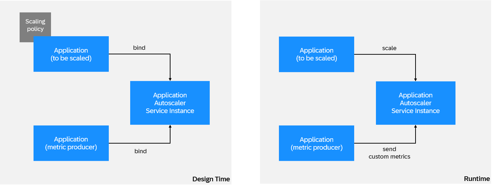

<!-- loio87e657e691ac48ba85fd777c042afbd8 -->

# Defining a Custom Metric

Define your own metrics to scale applications based on your requirements.


<a name="loio87e657e691ac48ba85fd777c042afbd8__context_mch_m4g_n4b"/>

## Context

As an alternative to the standard metrics provided by the Application Autoscaler, you can also define custom metrics such as lengths of job queues or technology-specific metrics like JVM heap usage for scaling. Custom metrics offer more flexibility, allowing you to scale applications based on your own requirements.

Applications can use custom metrics in the following scenarios:

-   An application sends custom metrics to the Application Autoscaler and the same application is scaled.

-   One application sends custom metrics to scale another application.


### Scenario 1

The following scenario describes an application sending custom metrics to the Autoscaler service and the same application is scaled.

To use custom metrics, you must implicitly define the custom metric by using it in the scaling policy and the application needs to emit custom metric values using the custom metrics API at regular intervals.

The following example shows a policy with a custom metric:

```
{
   "instance_min_count":1,
   "instance_max_count":4,
   "scaling_rules":[
      {
         "metric_type":"jobqueue",
         "breach_duration_secs":60,
         "threshold":100,
         "operator":">=",
         "cool_down_secs":120,
         "adjustment":"+1"
      }
   ]
}
```


### Scenario 2

The following scenario involves two different applications that are bound to the same Autoscaler service, for example, the metric producer app and an app that should be scaled. Here, the metric producer app sends custom metrics on behalf of the app to be scaled.

> ### Caution:
> This scenario is not supported with the deprecated “Basic Authentication”.



> ### Remember:
> To use custom metrics, you must implicitly define the custom metric by using it in the scaling policy and the metric producer app needs to emit custom metric values using the custom metrics API at regular intervals.

The scaling app should set `metric_submission_strategy.allow-from` to `bound_app` in the configuration of the scaling policy. This scaling policy is also attached with the application to be scaled.

> ### Note:
> The metric type used for custom metrics must not be any of the standard metric types.

> ### Tip:
> We recommend a minimum duration of one minute between successive emissions of a custom metric.

As part of the binding process, the Application Autoscaler service instance provides necessary credentials to emit custom metrics.

The generation of these credentials is based on the credential type parameter in the service binding. The supported credential types are binding-secret and x509. If no credential type is provided, x509 is used as the default credential type.


<a name="loio87e657e691ac48ba85fd777c042afbd8__steps_opm_ny3_ddc"/>

## Procedure

1.  Bind your application with the Application Autoscaler service instance using a policy that contains custom metrics scaling rule.

    **sample policy.json with credential Type as x509**

    > ### Sample Code:
    > ```
    > {
    >     "instance_min_count":1,
    >     "instance_max_count":4,
    >     "scaling_rules":[
    >         {
    >         "metric_type":"jobqueue",
    >         "breach_duration_secs":60,
    >         "threshold":100,
    >         "operator":">=",
    >         "cool_down_secs":120,
    >         "adjustment":"+1"
    >         }
    >     ],
    >     "credential-type": "x509"
    > }
    > ```

    **bind the service instance with the scaling policy**

    > ### Sample Code:
    > ```
    > cf bind-service <application> <application-autoscaler-service-instance> -c policy.json
    > ```

    > ### Note:
    > In the scenario in which a different app \(metrics producer app\) is used to send custom metrics details to the service, make sure that the metrics producer app is also bound to the service. The scaling policy must have the `metric_submission_strategy.allow-from` set to bound\_app in the configuration \(as shown in the following code example\).

    > ### Sample Code:
    > ```
    > {
    >     "configuration": {
    >     "custom_metrics": {
    >       "metric_submission_strategy": {
    >         "allow_from": "bound_app"
    >       }
    >     }
    >   },
    >    "instance_min_count":1,
    >     "instance_max_count":4,
    >     "scaling_rules":[
    >         {
    >         "metric_type":"jobqueue",
    >         "breach_duration_secs":60,
    >         "threshold":100,
    >         "operator":">=",
    >         "cool_down_secs":120,
    >         "adjustment":"+1"
    >         }
    >     ],
    >     "credential-type": "x509"
    > }
    > ```

2.  Read custom metrics binding credentials from the application environment.

    **Binding Credentials for mTLS**

    > ### Sample Code:
    > ```
    > "custom_metrics": {
    >       "mtls_url": "https://autoscaler-metrics-mtls.cf.<landscape>.hana.ondemand.com",
    >      }
    > ```

3.  **Authenticate with X.509 Certificate:**

    Your application requires a base url, certificate, and a private key for mutual TLS authentication \\\(mTLS\\\).

    -   Use the base URL provided in the `mtls_url` of the service binding.

    -   Use the X.509 certificate and private key from the paths provided in the environment variables `CF_INSTANCE_CERT` and `CF_INSTANCE_KEY` respectively.


    > ### Note:
    > The environment variables `CF_INSTANCE_CERT` and `CF_INSTANCE_KEY` are not shown in the cockpit or using the `cf env` command. They're only visible inside the running application container.

    > ### Note:
    > The X.509 certificate and private key pair are valid for 24 hours. At least 20 minutes before expiration, they're regenerated and new files replace the existing files. Make sure that your code reloads the X.509 certificate and private key pair if they're expired. See [Using Instance Identity Credentials](https://docs.cloudfoundry.org/devguide/deploy-apps/instance-identity.html) in the Cloud Foundry Documentation.

    **Authenticate with Basic Authentication \(Deprecated, don't use\):**

    `url`, `username`, and `password` in the application environment are provided for backwards compatibility with the HTTP basic authentication scheme and shouldn't be used going forward. If your application still needs to authenticate with basic authentication, use credential-type binding-secret in the service binding and plan to migrate to mTLS \(\`x509\`\) authentication until April 30, 2025.

4.  Push custom metrics at an interval of your choice using APIs. For the REST API specification, see [Application Autoscaler custom metrics API](https://api.sap.com/api/ApplicationAutoscalerCustomMetricsAPI/resource).
